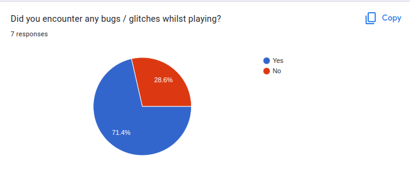

# 3.2 Usability Testing

## Criteria To Assess

In order to access the overall experience of my project and how it matches up against my criteria I will collect feedback from a small group of users who had played my game.

| Test                   | Test Details                                                                            |
| ---------------------- | --------------------------------------------------------------------------------------- |
| 1 - Easy to Learn      | Are the controls easy to understand? Is the menu easy to navigate?                      |
| 2 - Error tolerant     | Did you encounter any bugs whilst playing? Is you answered yes please detail bugs found |
| 3 - Engaging / Visuals | I found the visual style appealing                                                      |
| 4 - Efficient          | Are different areas in the map easy to find / access?                                   |
| 5 - Effective          | There is a sufficient amount of gameplay to enjoy                                       |

Listed below are the results to the questions. I will go over the results in depth during the evaluation

### User Feedback

**Question 1**

<figure><figcaption></figcaption></figure>

Majority of people who had tested my game found the controls intuitive with  roughly 3 quarters of the players either agreeing or strongly agreeing with the prompt with about a quarter saying they felt neutrally about the prompt. This shows that majority found the controls relatively easy to get a grasp of with no one disagreeing with the statement.

**Question 2**

<figure><figcaption></figcaption></figure>

This question demonstrates how majority of players found one bug whilst playing but none that significantly impacted the gameplay or caused the game to fully stop working or crash. These will be fixed in the near future and can be discussed in the evaluation on why the number of minor bugs was so high.&#x20;

**Question 3**

<figure><figcaption></figcaption></figure>

Question 3 discusses the visual style of the game since I believe this is a very important part of keeping the player engaged. An overwhelming majority of the players responded they strongly agreed with the statement with the others still agreeing that the style was appealing.

**Question 4**

<figure><figcaption></figcaption></figure>

Question 4 highlights the accessibility of the features and where the player should next go in the game through visual cues. An overwhelming majority replied saying they found the different areas easy to access with 14.3% saying they strongly agreed with the prompt.

**Question 5**

<figure><figcaption></figcaption></figure>

Question 5 discusses the idea of sufficient gameplay amounts to enjoy which is the area this game may have lacked. The reason a majority of respondents felt neutral on the prompt was that the game can be completed very quickly if the player knows the quests to complete and is not that long of an experience. This will be discussed further in evaluation but will be taken further with more given time allocated to development.

**Question 6**

<figure><figcaption></figcaption></figure>

Question 6 talks about the main menu and whether it is easy to navigate and use. An overwhelming majority strongly agreed with the statement with just over a quarter of the users still agreeing that overall the menu is easy to use and navigate.

## Usability Requirements in Success Criteria

Some of the success criteria requirements fall into the section of usability. These will also be tested now and are listed below:

| Criterion | Description           |
| --------- | --------------------- |
| X         | describe the critiera |

### Criterion X

Describe testing against criteria
