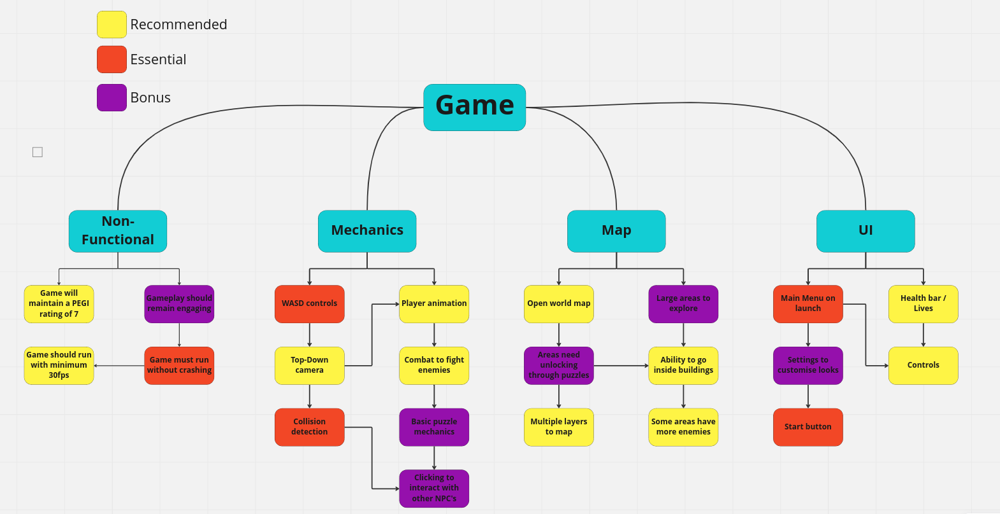

# 2.1 Design Frame

<figure><figcaption></figcaption></figure>

## Systems Diagram

I have created a Systems Diagram to outline the various components of the game I am developing. The diagram is based on my goals and success criteria for the project, and is divided into smaller sub-sections. To streamline the development process, I plan to work on one or two sections at a time, gradually assembling the game using computational methods.

## Usability Features

My game's usability is a top priority as I want it to be accessible to all players. To create the best user experience, I will focus on five key points: effectiveness, efficiency, engagement, error tolerance and making the game easy to learn.

### Effective

Users can achieve the goal with completeness and accuracy. To do this, I will make the map simplified and not complicated to navigate. This also ties into my point I mentioned earlier about making the game fair but challenging - this will create an effective gameplay for the user.

#### Aims

* Create a fair gameplay environment for the user
* Keep the map exploration fun but not too hard to navigate

### Efficiency

Efficiency relates to the speed and accuracy to which a user can complete the goal. To do this, I will aim to create a menu system which is easy to navigate through in order for to find what you are looking for making sure the process of starting the game remains simple.

#### Aims

* Create an automatic system to load the game where it was set off to avoid any complication of loading saves
* Create a controls system that isn't too complicated but allows the player to perform multiple actions while playing

### Engaging

The solution is engaging for the user to use. To do this, I will create a visually appealing art style involving pixel art to make sure they aren't pushed away by the graphics and giving a large amount of content to explore to make sure they remain engaged.

#### Aims

* Create a large map and area to explore for the players
* Incorporate a style of game art the suits the game

### Error Tolerant

To minimize errors and ensure a smooth gameplay experience, I will write code that can handle various scenarios and can self-correct if any errors occur. This will prevent the game from crashing during playtime.

#### Aims

* The game should not crash
* The game does not contain any bugs that damage the users experience playing

### Easy To Learn

To make the game user-friendly, I will design simple controls that are easy to understand and use. I will avoid adding unnecessary controls, keeping the game as straightforward as possible for players.

#### Aims

* The game should not take long to understand and get the hang of
* The game should not be too difficult for an individual to not complete and enjoy\


## Pseudocode for the Game

### Pseudocode for game

This is the basic layout of the starting point for my game using PhaserJS showing a basic scene setup which would later evolve into a map file. The assets will be stored within a separate file to make it easier to read the main game file.&#x20;

```
// Create a new Phaser scene
var scene = new Phaser.Scene('SceneName');

// Preload assets needed for the scene
scene.preload = function() {
    // load assets here
}

// Initialize the scene
scene.create = function() {
    // initialize variables, create game objects, add event listeners, etc.
}

// Update the scene
scene.update = function() {
    // update game logic, physics, animations, etc.
}

// Add the scene to the game
game.scene.add('SceneName', scene);

// Start the scene
game.scene.start('SceneName');

```

### Pseudocode for a PreLoader

This shows the basic layout of code for a PreLoader. Whilst this is only pseudocode this demonstrates how the functionality would work loading in all the assets separately to make the main scenes more readable

```
// Create a new preloader object
var preloader = new Phaser.Loader.LoaderPlugin();

// Add assets to the preloader
preloader.spritesheet('character', 'path/to/character.png');
preloader.image('background', 'path/to/background.png');
preloader.audio('music', 'path/to/music.mp3');

// Set up the load main menu and loading bar
var mainmenu = new Phaser.GameObjects.Graphics();
preloader.on('progress', function(value) {
    progressBar.clear();
    progressBar.fillStyle(0xffffff, 1);
    progressBar.fillRect(250, 280, 300 * value, 30);
});

// Once assets are loaded, start the game
preloader.onclick('complete', function() {
    game.scene.start('maingame');
});

// Start loading the assets
preloader.start();

```
